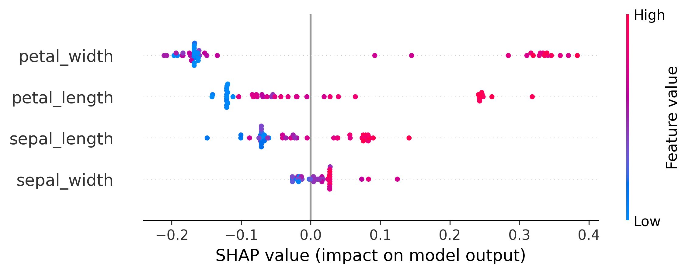
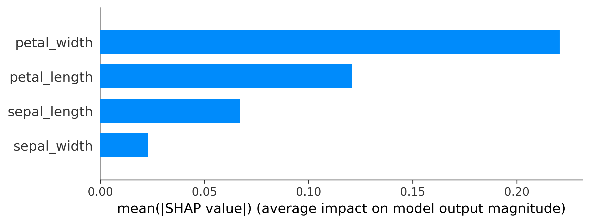
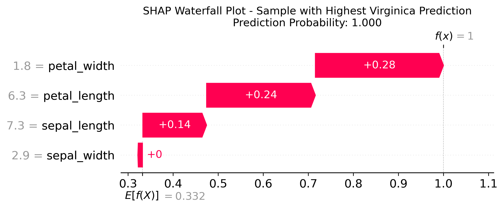
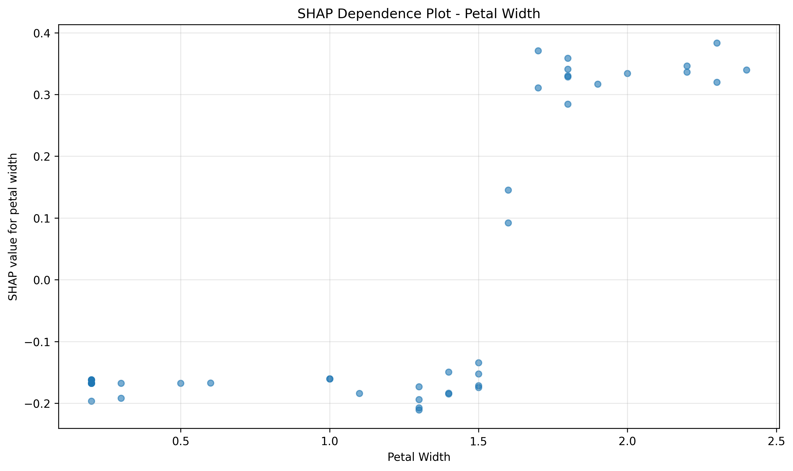
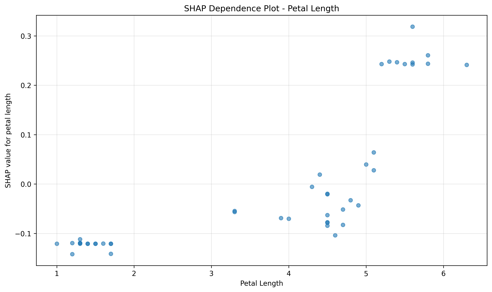
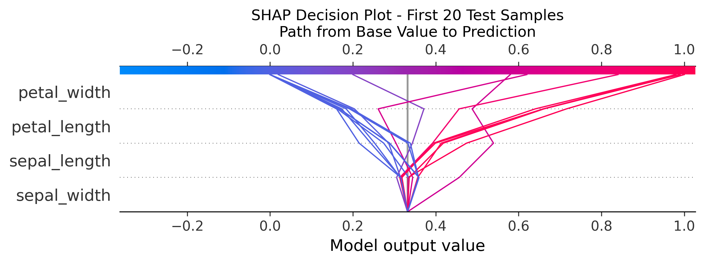

# SHAP Explainer Analysis for Virginica Class - Complete Dataset Explanation

## What is SHAP?
SHAP (SHapley Additive exPlanations) is a method that helps us understand **why** our machine learning model makes specific predictions. Think of it as a way to see which features "pushed" the model towards predicting a particular flower species.

## SHAP Explainer Plots for the Full Dataset

This section presents comprehensive SHAP analysis plots generated from our complete IRIS dataset with location-based bias. All plots focus on **virginica classification** to understand how the model identifies this species.

### 1. SHAP Summary Plot - Feature Impact Overview

**What this shows:**
- Each dot represents one flower sample from our test dataset
- The x-axis shows SHAP values (positive = pushes toward virginica, negative = pushes away)
- Features are ranked by importance (most important at top)
- Color indicates feature value (red = high, blue = low)

**Key insights:**
- **Petal width** (top) has the strongest impact on virginica predictions
- High petal width values (red dots) strongly favor virginica classification
- **Petal length** is the second most important feature
- Sepal measurements have much smaller impacts

### 2. Feature Importance Ranking

**Current feature importance for virginica classification:**
1. **Petal Width: 51.2%** - Most decisive feature
2. **Petal Length: 28.0%** - Strong secondary indicator  
3. **Sepal Length: 15.5%** - Supporting evidence
4. **Sepal Width: 5.3%** - Minimal impact

### 3. SHAP Waterfall Plot - Individual Prediction

**What this shows:**
- How each feature contributes to a single prediction (highest confidence virginica sample)
- Starting from the base value (average prediction)
- Each bar shows how much each feature pushed the prediction up or down
- Final prediction probability is shown

**Reading the plot:**
- Green bars push **toward** virginica prediction
- Red bars push **away from** virginica prediction
- The size of each bar shows the magnitude of impact

### 4. SHAP Dependence Plots

#### Petal Width Dependence

**Interpretation:**
- Shows how petal width values relate to SHAP values for virginica
- Higher petal width → higher SHAP values → stronger virginica prediction
- Clear positive relationship demonstrates why petal width is the top feature

#### Petal Length Dependence  

**Interpretation:**
- Similar pattern to petal width but with more variation
- Longer petals generally favor virginica classification
- Some scatter indicates interactions with other features

### 5. SHAP Decision Plot - Multiple Samples

**What this shows:**
- Decision paths for the first 20 test samples
- Each line represents one flower's journey from base value to final prediction
- Features are ordered by importance (bottom to top)
- Lines ending on the right indicate virginica predictions

**Key patterns:**
- Samples with high petal measurements (top features) tend to end up as virginica
- The decision paths clearly show how feature combinations lead to predictions
- Some samples have conflicting features that create uncertainty

## Understanding SHAP Analysis Results

### Feature Importance Analysis for Virginica

Based on our Random Forest model with location bias, here's what we found:

#### Top Contributing Features (in order of importance):

1. **Petal Width (51.2% importance)** 🌺
   - **What it means**: The width of the flower's petals is the strongest indicator
   - **For virginica**: Virginica flowers typically have wider petals (>1.4 cm)
   - **Simple explanation**: If you see a flower with wide petals, it's likely a virginica
   - **SHAP insight**: High petal width values consistently produce large positive SHAP values

2. **Petal Length (28.0% importance)** 🌸
   - **What it means**: The length of the petals is the second most important feature
   - **For virginica**: Virginica flowers usually have longer petals (>4.5 cm)
   - **Simple explanation**: Long petals combined with wide petals strongly suggest virginica
   - **SHAP insight**: Shows positive correlation with virginica prediction but with more variability

3. **Sepal Length (15.5% importance)** 🌿
   - **What it means**: The length of the sepals provides additional supporting information
   - **For virginica**: Contributes to the overall size pattern that distinguishes virginica
   - **Simple explanation**: Longer sepals support the virginica prediction but aren't decisive
   - **SHAP insight**: Moderate positive impact, often confirms what petal measurements suggest

4. **Sepal Width (5.3% importance)** 🍃
   - **What it means**: The width of the sepals has minimal impact on virginica classification
   - **For virginica**: Less distinctive compared to petal measurements
   - **Simple explanation**: Sepal width doesn't tell us much about whether it's virginica
   - **SHAP insight**: Small, inconsistent SHAP values indicating low predictive power

### How to Read the SHAP Analysis

#### Positive Contributions (Push TOWARDS virginica):
- High petal width values → Strongly suggests virginica
- High petal length values → Strongly suggests virginica  
- Larger sepal length → Moderately suggests virginica

#### Negative Contributions (Push AWAY from virginica):
- Low petal width values → Suggests NOT virginica (likely setosa)
- Low petal length values → Suggests NOT virginica (likely setosa)

### Real-World Interpretation

**If you were identifying flowers manually**, the SHAP analysis tells us:

1. **First, look at petal width**: Wide petals? Probably virginica (51% of the decision)
2. **Second, check petal length**: Long petals? This confirms virginica (28% of the decision)
3. **Third, consider sepal length**: Large sepals? Additional evidence for virginica (15% of the decision)
4. **Finally, sepal width**: Don't worry too much about this measurement (only 5% impact)

### Fairness Considerations with Location Bias

Our model includes a **location** attribute (0 or 1) representing where the flower was found. The fairness analysis shows significant bias:

- **Location 0 accuracy**: 80.0% (25 test samples)
- **Location 1 accuracy**: 95.0% (20 test samples)  
- **Accuracy gap**: **15.0% difference** between locations
- **Bias assessment**: This represents **significant unfairness** in model performance

**SHAP implications for bias:**
- The SHAP analysis reveals that the model relies heavily on petal measurements
- Location bias was introduced by systematically reducing petal measurements for virginica samples in location 0
- This creates unfair disadvantage where the model's most important features are artificially diminished for certain groups

### Key Takeaways from SHAP Analysis

1. **Petal measurements dominate**: Width (51%) and length (28%) account for 79% of virginica classification decisions
2. **Clear feature hierarchy**: There's a dramatic difference between petal features and sepal features in importance
3. **Interpretable patterns**: SHAP dependence plots show clear positive relationships for top features
4. **Model transparency**: We can explain exactly why the model predicts virginica for any given sample
5. **Bias detection**: SHAP analysis helps understand how introduced location bias affects feature importance

### What This Means for Model Users

- **Trust the petal measurements**: When the model predicts virginica, it's primarily because of petal size (79% of decision)
- **Understand the decision path**: Waterfall and decision plots show exactly how each feature contributed
- **Be aware of bias**: The 15% accuracy gap indicates systematic unfairness that needs addressing
- **Use SHAP for debugging**: When predictions seem wrong, check if petal measurements align with expected patterns
- **Explainable predictions**: Every virginica prediction can be broken down into specific feature contributions

### Technical Notes

- **Model**: Random Forest with 100 trees, trained on 105 samples, tested on 45 samples
- **SHAP method**: TreeExplainer for exact SHAP values from tree-based models
- **Focus**: Analysis specifically targets virginica class (class 2) predictions
- **Bias simulation**: Systematic 15-20% reduction in petal measurements for location 0 virginica samples
- **Feature importance**: Calculated from mean absolute SHAP values across all test samples

This comprehensive SHAP analysis provides both intuitive understanding and technical insights into how our iris classification model makes decisions, while clearly identifying the significant fairness issues that need to be addressed before deployment.