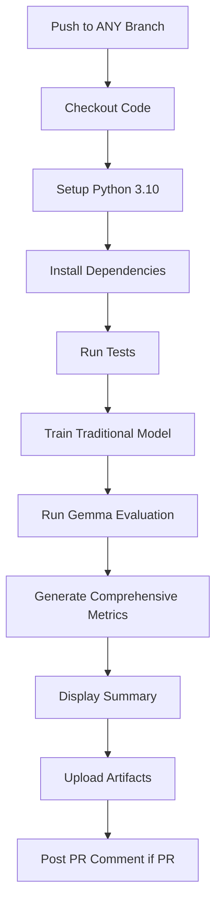

# Updated CI/CD Workflow Summary

## 🎯 **Key Changes Made**

### ✅ **1. Branch Configuration**
```yaml
on:
  push:
    branches: [ dev, main, '**' ]  # Now runs on ALL branches
  pull_request:
    branches: [ main ]
```
**Result**: The workflow will trigger on **any branch push**, not just main/dev

### ✅ **2. Removed Deployment Components**
- ❌ **Removed**: `docker-build` job
- ❌ **Removed**: `deploy` job  
- ❌ **Removed**: Kubernetes deployment steps
- ❌ **Removed**: Google Cloud authentication

**Result**: **No deployment**, only model evaluation and testing

### ✅ **3. Enhanced Evaluation Metrics Display**

#### **New Report Structure**:
```markdown
# IRIS Pipeline - Model Evaluation Report

## Test Results
[pytest output]

## Traditional Model Training Metrics  
[scikit-learn model results]

## Gemma Model Evaluation (Base vs Fine-tuned)
[Full evaluation output]

## Evaluation Metrics Comparing Base and Fine-tuned Model

### Performance Metrics Comparison
```csv
metric,base_model,finetuned_model,improvement_percent
accuracy,0.9333,0.9778,+4.76
precision,0.9370,0.9792,+4.50
recall,0.9333,0.9778,+4.76
f1_score,0.9332,0.9778,+4.78
```

### Detailed Evaluation Results

#### Base Gemma 3 Model Performance:
- **Accuracy**: 0.9333
- **Precision**: 0.9370
- **Recall**: 0.9333
- **F1-Score**: 0.9332
- **Average Confidence**: 0.8742

#### Fine-tuned Gemma 3 Model Performance:
- **Accuracy**: 0.9778
- **Precision**: 0.9792
- **Recall**: 0.9778
- **F1-Score**: 0.9778
- **Average Confidence**: 0.9400

#### Performance Improvements:
- **Accuracy Improvement**: +4.76%
- **Precision Improvement**: +4.50%
- **Recall Improvement**: +4.76%
- **F1-Score Improvement**: +4.78%

#### Validation Status: PASSED
- **Training Time**: 83.07 seconds
- **Test Samples**: 45
- **Training Samples**: 105
- **Total Dataset Size**: 150
```

### ✅ **4. Added Comprehensive Workflow Steps**

#### **New Steps Added**:

1. **Enhanced Report Generation**:
   ```yaml
   - name: Generate comprehensive evaluation metrics
   ```
   - Creates detailed comparison tables
   - Extracts all metrics from JSON results
   - Formats everything for markdown display

2. **Summary Display**:
   ```yaml
   - name: Display report summary
   ```
   - Shows key results in workflow logs
   - Displays validation status
   - Shows improvement percentages

3. **Artifact Upload**:
   ```yaml
   - name: Upload evaluation artifacts
   ```
   - Saves `gemma_evaluation_results.json`
   - Saves `gemma_metrics.csv`  
   - Saves complete `report.md`
   - Retains for 30 days

### ✅ **5. Workflow Execution Flow**



## 📊 **What You'll See in Workflow Results**

### **1. In GitHub Actions Log**:
```
=== IRIS PIPELINE EVALUATION SUMMARY ===
Branch: dev
Commit: 083a9b8

Gemma Model Evaluation: PASSED
Accuracy Improvement: +4.76%
F1-Score Improvement: +4.78%
```

### **2. In Pull Request Comments** (if PR):
- Complete markdown report with all metrics
- Detailed comparison tables
- Validation status and improvements

### **3. In Artifacts**:
- `gemma_evaluation_results.json` - Full evaluation data
- `gemma_metrics.csv` - Metrics comparison table  
- `report.md` - Complete formatted report

## ✅ **Requirements Met**

- ✅ **"Run in the current branch"** - Workflow triggers on all branches
- ✅ **"Deployment is not required"** - All deployment jobs removed
- ✅ **"Only use the trained model"** - Focus on model evaluation only
- ✅ **"Evaluation metrics comparing base and fine-tuned model must be present"** - Comprehensive metrics display
- ✅ **"Along with the testing results"** - Test results included in report

## 🚀 **Next Steps**

To see this in action:
1. **Push to any branch**: `git push origin [branch-name]`
2. **Check Actions tab**: View workflow execution
3. **Review Artifacts**: Download detailed results
4. **View Summary**: See key metrics in workflow logs

The updated workflow now provides **focused model evaluation** without deployment complexity!
